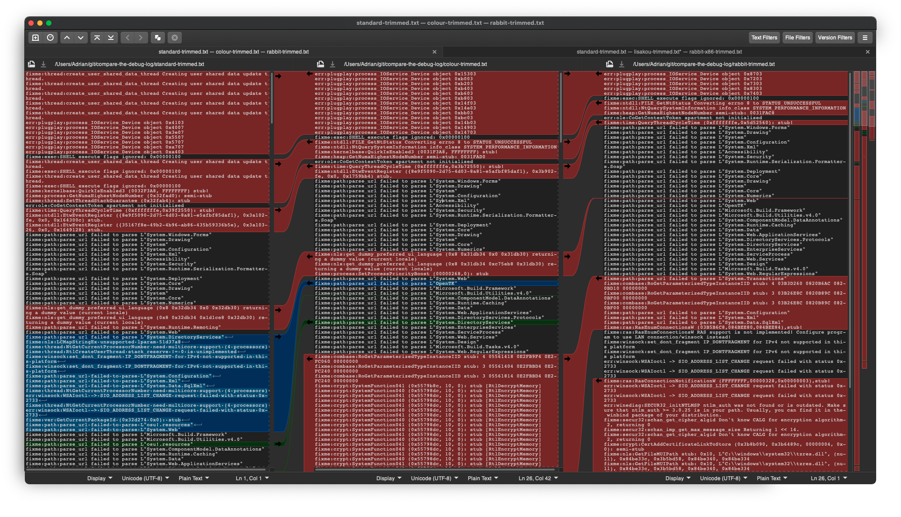

########################################
SilentCrash
########################################

.. rst-class:: wineskin-version
    
    | This article is applicable to the following wrappers:
    | • `Technocoder <https://osu.ppy.sh/users/10338558>`_'s `Wineskin with macOS Catalina 10.15 support <https://osu.ppy.sh/community/forums/topics/1106057>`_
    | • `Technocoder <https://osu.ppy.sh/users/10338558>`_'s `Wineskin with Apple Silicon support <https://osu.ppy.sh/community/forums/topics/682197>`_

SilentCrash is a user-reported issue with the osu! Wineskins that occured around July - September 2021, affecting both the Apple Silicon and x86 Wineskins on predominantly Apple Silicon devices on Big Sur, but also a small subset of x86 devices.

- Users would properly install the osu! wrapper
- The game may update or even begin to load, but will immediately close without warning upon startup
- WINE logs do not provide any obvious error messages
- osu!macOS Agent reports are usually clean
- Logs appear to be extremely similar to a normal executable run and closure

****************************************
Preliminary analysis
****************************************

The first obvious step was to compare Wineskin Test Run logs in the hope they'd be useful to give away any obvious error. Using the `Meld <http://meldmerge.org/>`_ diff viewer showed that there were no useful differences between a standard run executed on my system, and user-received reports.

In past times we had another bug with .NET that was easily identifiable within Test Run logs, and indicative of a race condition related to low-level runtime issues (i.e garbage collection, binary translation) but could be fixed usually through updating the dotnet Winetrick. The SilentCrash issue represents the first emergence of a similarly symptomatic error, but it is likely different, if not unrelated.

****************************************
Running on Apple Silicon
****************************************

I was unable to reproduce the user reports on my Intel 80386 based Mac, so I borrowed a family member's 2020 MacBook Air with M1. I could not reproduce the error and osu! ran successfully.

****************************************
Regression testing
****************************************

Considering this issue popped up with the first confirmed user report on 11 July 2021, it could have possibly been a regression within the osu! executable. The Wineskin was last updated on 15 February 2021, and the issue is persistent across both Apple Silicon and i386 Wineskins. Looking through the osu! changelogs from around this time, there is a particularly interesting `changelog update <https://osu.ppy.sh/home/changelog/stable40/20210519.3>`_ dated 19 May 2021.

    |**Improve reliability of beatmap detail fetches**
    |Fixes a startup race condition that could randomly cause beatmaps to get stuck in an "unknown" status rather than fetching their online details successfully. Any beatmaps already in this state will automatically check for new details each startup.

We don't have access to the source for stable, and we don't know how this logic was implemented. Searching the osu!dev Discord server brought about limited results too. 

In any case however, the osu! executable is an entirely valid PE32 executable. If a change in the program's logic is in fact causing a crash, the fix is incumbent on us and not on osu!. Regardless of whether or not a regression was included in the osu! execuable, this calls for further analysis through debugging.

However, WineHQ AppDB [bug 50111](https://bugs.winehq.org/show_bug.cgi?id=50111) does in fact show a regression introduced with the osu! executable as I had initially suspected. However, this regression was dated with osu-stable 20201110 and produced a Wine Mono error. Furthermore, notably osu! produces a crash error, which does not exist on our own user reports. Only `user report #2 <https://osu.ppy.sh/community/forums/posts/8221806>`_ mimics this behaviour.

    0204:fixme:wmiutils:status_code_GetErrorCodeText 103EB910, 0x80041002, 0x0000, 0x00000001, 0C74F374

User reports have mostly died down for now. Updating dotnet, which is the recommended resolution in 50111 (and the previously offered resolution), should continue to be recommended to users.

****************************************
Debugging with lldb
****************************************

In future, we should consider debugging to analyse the source issues (e.g regressions introduced into the executable such as this one). The main challenges are packaging this process in a user-friendly format, and being able to interpret the debugging on a Mono application for which we do not have source.

Although I was originally going to use winedbg and gdb, both are incompatible for different reasons.

- **winedbg** does not run with wine32on64
- **gdb** requires a painful code-signing procedure to run on modern macOS

Technocoder suggested to me that I use **lldb** to debug osu! - so using LLDB I want to generate a healthy startup stack trace.

Most user reports detail a successful update sequence and osu! logo followed by an immediate crash on startup. 

========================================
gdbidoof
========================================

To overcome this, I am working on a small general-purpose debugging utility called gdbidoof. This would be used by end users to run a stack trace just before a crash, using the obscurely documented ``--batch`` mode brought to life by this `Stack Overflow comment by John <https://stackoverflow.com/a/36580453/6299634>`_.

gdbidoof performs an end user-friendly version of the comment above with added features. Given that multiple processes are used by WINE, we'll instead ask the user to use a (0d) PID on Wineserver and all preloader processers. Failing or otherwise, we'll run backtraces on all threads (or the most recent core dump). This will help us narrow down what sort of instructions are being executed at a time of a crash (particularly a silent crash with no obvious errors).

This program is currently under development.

.. note::

    Requires lldb-340.4.119 (Xcode 7.2) or greater

.. code-block:: bash

    -b 
    --batch 
            Tells the debugger to running the commands from -s, -S, -o & -O,
            and then quit.  However if any run command stopped due to a signal
            or crash, the debugger will return to the interactive prompt at the
            place of the crash.

    -o 
    --one-line 
            Tells the debugger to execute this one-line lldb command after any
            file provided on the command line has been loaded.

    -k 
    --one-line-on-crash 
            When in batch mode, tells the debugger to execute this one-line
            lldb command if the target crashes.

.. todo::

    Run immediate backtrace on startup - this is where the game is quitting for end-users. And you should run it on a M1 as well

***

****************************************
List of user reports
****************************************

========================================
Related to SilentCrash
========================================

- `User report #1 <https://osu.ppy.sh/community/forums/posts/8191421>`_
- `User report #2 <https://osu.ppy.sh/community/forums/posts/8221806>`_
- `User report #3 <https://osu.ppy.sh/community/forums/posts/8247767>`_ (may be unrelated)

========================================
Other user issues
========================================

- `User report A <https://osu.ppy.sh/community/forums/posts/8162613>`_
- `User report B <https://osu.ppy.sh/community/forums/posts/8168700>`_ (possibly related; no test run to confirm)

.. todo::

    Need to add cpu core priority/affinity to end user troubleshooting

***

****************************************
Acknowledgements
****************************************

- Thanks to `Technocoder <https://osu.ppy.sh/users/10338558>`_ for useful information about debugging with LLDB
- Thanks to `Gcenx <https://github.com/Gcenx/>`_ for useful information about winedbg
- Thanks to `aidas956 <https://bugs.winehq.org/show_bug.cgi?id=50111>`_ for their bug report on WineHQ Bugzilla

========================================
Useful resources
========================================

- `Wine Developer's Guide/Debugging Wine <https://wiki.winehq.org/Wine_Developer%27s_Guide/Debugging_Wine>`_
- `Debugging Hints <https://wiki.winehq.org/Debugging_Hints>`_