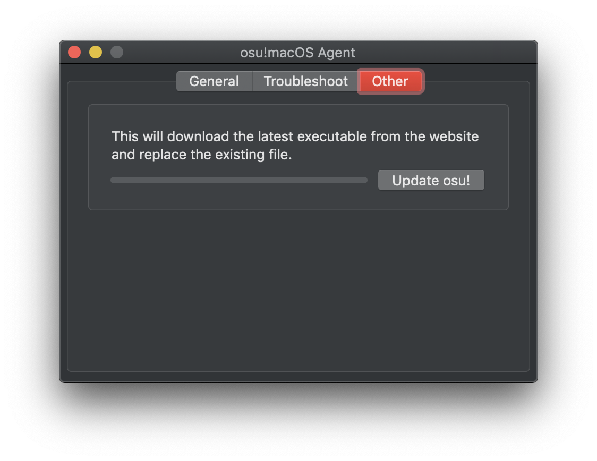

###########################################################
slc's Wineskin for macOS 10.14 Mojave and earlier
###########################################################

.. rst-class:: wineskin-version
    
    | This article is applicable to the following wrappers:
    | • `slc <https://osu.ppy.sh/users/7978076>`_'s `Wineskin for macOS 10.14 Mojave and earlier <https://drive.google.com/uc?id=16lR87eCVYtpjiK6KKA4rNghfpimnj1aE&export=download>`_

This guide will walk you through how to install `slc <https://osu.ppy.sh/users/7978076>`_'s Wineskin for **macOS 10.14 Mojave and earlier.** If you are using macOS Catalina 10.15 or later, view the `Catalina tutorial <10-15.html>`_ instead.

.. to-do: Making Your Own Wrapper section ?

****

****************************************
Step 1: Download the Wineskin
****************************************

**Download the osu! Wineskin from slc:**

- **osu! forum thread:** `community/forums/topics/682197?start=6919344 <https://osu.ppy.sh/community/forums/topics/682197?start=6919344>`_
- **Google Drive download link (248MB):** `https://drive.google.com/... <https://drive.google.com/uc?id=16lR87eCVYtpjiK6KKA4rNghfpimnj1aE&export=download>`_

.. note::

    To play osu! on macOS a compatibility layer called **Wine** is used. A **Wineskin** allows a preconfigured version of Wine to be bundled as one app so that you can get right into the game without messing about with the settings.

Once it has downloaded, extract the ``.zip`` file. 

**Move it outside of your Downloads folder, such as your Desktop.** This is really important, as not doing so could lead osu! to be `sandboxed <https://en.wikipedia.org/wiki/Sandbox_(computer_security)>`_.

We also recommend downloading `Technocoder <https://osu.ppy.sh/users/10338558>`_'s osu!macOS Agent program, since it'll be used throughout this guide. In general, it's a great tool that every macOS osu-stable player on Wine should have. However, this is optional (though strongly encouraged) and alternative instructions are provided for those who are comfortable with digging deeper.

- **osu! forum thread:** `community/forums/topics/1036678 <https://osu.ppy.sh/community/forums/topics/1036678>`_
- **GitHub download link (7.61MB):** `<https://github.com/Techno-coder/... <https://github.com/Techno-coder/osu-macOS-Agent/releases/download/refs%2Fheads%2Fmaster/osu.macOS.Agent.zip>`_

.. warning::

    On 12 October 2020 a bug was introduced with an update for osu!macOS Agent. It caused Wineskin.app to display a error that left the settings menu unopenable. You'll need to `download the newest version of osu!macOS Agent <https://osu.ppy.sh/community/forums/topics/1036678>`_, which was updated on 23 January 2020. See `Wineskin.app doesn't open, even if osu! does / exec[number].bat problem <../issues/wineskin.html>`_.

****

****************************************
Step 2: Repair the Wineskin
****************************************

If you try to open the Wineskin immediately, macOS will say that it's broken.

1. Open osu!macOS Agent
2. Click the **Troubleshoot** tab
3. Click **Scan**
4. Once the scan is complete, click **Repair**

If it was successful, you should see a **Fixed** indicator next to ``Quarantine attribute is present`` in the log.

.. image:: ../assets/osu-agent-log.png
    :alt: 'osu!.app is damage and can't be opened. You should move it to the Bin.

.. raw:: html

    

    
<h4 style="display: inline;">Alternative option: Using the Terminal</h4>

     

On the bleeding edge? You can also use the Terminal to repair your Wineskin.

1. Open Terminal. It should be in your ``Applications/Utilities`` folder.

2. Type the following command.

.. code-block:: bash

    sudo xattr -rd com.apple.quarantine "~/path/to/my/osu\!.app"

where ``~/path/to/my/osu\!.app`` is the filepath to your osu! install. 

For example: if my ``osu!.app`` was in the Desktop, the command to enter would be:

.. code-block:: bash

    sudo xattr -rd com.apple.quarantine "/Users/Adrian/Desktop/osu!.app"

Below are some helpful tips if you're a bit lost, but if you know what you're doing feel free to skim over them.

.. note::

    For an application with the name ``osu!.app``, the ``!`` will confuse the Terminal window. Therefore, you must `escape <https://en.wikipedia.org/wiki/Escape_character>`_ it by prefixing the ``!`` with a ``\`` (backslash) to form ``osu\!.app``. It is also recommended you enclose the filepath in quotation marks.

.. note::

    You may be asked for your password. While entering your password the cursor might blink but you won't see any characters appear on the screen - this is normal! Just proceed to type your password as if there was a dialog box there, and hit *Enter* once you're done. (If you stuffed it up you'll get another chance to retype it.)
    
.. tip:: 

    If you get a ``Permission denied`` error it means you aren't using an administrator account. In your Terminal window, type:

        .. code-block:: bash
       
            su - administrator

    where ``administrator`` is the name of your system's admin account. When the ``Password:`` prompt appears, enter your password for ``administrator`` (or whatever your admin account is). Then try running the Terminal command again (or to do this automatically, type ``sudo !!``).

    If you don't know which account is your admin account (like if you use a family computer), go to the ``Apple menu`` (top-left corner of the screen) > ``System Preferences...`` > ``Users & Groups`` and you should be able to see which account is your administrator account. You'll still need the password to execute the command though.

.. note::

    On older macOS versions, you may get a warning that looks like this. 

        .. code-block:: bash

            Improper use of the sudo command could lead to data loss or the deletion of important system files. Please double-check your typing when using sudo. Type "man sudo" for more information. To proceed, enter your password, or type Ctrl-C to abort.

    Type your password as normal, as shown above.

.. tip::

    Having trouble finding the filepath of your osu! installation? You can drag and drop the file from your installation directory (or the Desktop) to get the path!

    .. image:: ../assets/terminal-drag-and-drop.gif
        :alt: Dragging and dropping osu!.app into the terminal

    |
    | My Terminal will look slightly different to yours, but the concept (and the command!) remains the same.

.. warning:: 

    Unless you do something incredibly stupid, you probably won't completely stuff your computer. That being said, if you do something incredibly stupid, you'll stuff your computer. The ``sudo`` command allows your local user account to perform otherwise restricted actions, so please don't go around typing random things if something's not working - ask us a question instead!

.. raw:: html

    

     

****

****************************************
Step 3: Updating osu!
****************************************

At this point, you should have already repaired osu! and now you're set to open it. In some cases, this will work perfectly, but for most people including myself, osu! will be stuck in an update loop. It can even be difficult to kill the process once it starts updating.

.. tip::

    If you ever have trouble closing osu! once it's stuck in an update loop, see `Common issues: osu! won't close <../issues/wontclose.html>`_.

.. note::

    Does osu! appear to be running fine? If you're not stuck in an update loop, then you can easily skip this section.

1. Open osu!macOS Agent
2. Click the **Other** tab
3. Click **Update osu!**

This will download the latest executable from the osu! servers and replace the existing ``osu!.exe`` inside your Wineskin wrapper. 

.. raw:: html

    

    
<h4 style="display: inline;">Alternative option: Manually installing the latest version of osu!</h4>

     

If you're brave enough to go it alone, these steps will get you the latest version of osu! running - avoiding the possibility of an update loop.

1. Download ``osu.exe`` from `osu.ppy.sh/home/download <https://osu.ppy.sh/home/download>`_.
2. Locate where ``osu!.app`` (your Wineskin) is installed
3. Right click on it and select ``Show Package Contents``
4. You should now see three files/folders: ``Contents``, ``drive_c`` and ``Wineskin``. Click ``drive_c``.
5. From here, click ``osu!``.
6. From here, locate ``osu!.exe`` and replace this file with the updated version that you just downloaded. Make sure you keep the filename the same.

.. raw:: html

    

     

****

****************************************
Step 4: Run osu!
****************************************

Now everything should be good to go! Click ``osu!.app`` in whichever directory you placed it in and try it out for a spin!

Did things not go to plan? Check out `Common issues <../issues/index.html>`_ to see if someone else has encountered your problem before, or ask a question on the osu! forums.

If everything turned out fine, check out `Setting up your screen options <../issues/screen.html>`_ and `Welcome to osu! <../welcome/index.html>`_ to improve your osu! experience. We'd recommend doing this before you start clicking circles.

