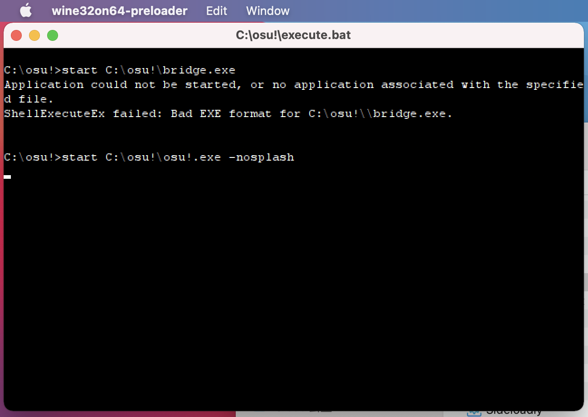

###################################################
Command prompt window showing before osu! crashes
###################################################

.. rst-class:: wineskin-version
    
    | This article is applicable to the following wrappers:
    | • `Technocoder <https://osu.ppy.sh/users/10338558>`_'s `Wineskin with macOS Catalina 10.15 support <https://osu.ppy.sh/community/forums/topics/1106057>`_
    | • `Technocoder <https://osu.ppy.sh/users/10338558>`_'s `Wineskin with Apple Silicon support <https://osu.ppy.sh/community/forums/topics/1106057>`_

When trying to start osu! you see a command prompt window like this one:

This error message is safe to ignore (as it relates to incompatibilities within Discord Rich Presence) and is separate to any issue you may experience in trying to get the game to run. If you're experiencing this issue, you should check out our `.NET runtime issues <dotnet.html>`_ troubleshooting page instead.

****

****************************************
Related links
****************************************

- https://osu.ppy.sh/community/forums/posts/7922372
- https://osu.ppy.sh/community/forums/posts/7908252
- https://osu.ppy.sh/community/forums/posts/7897992
- https://osu.ppy.sh/community/forums/posts/7897948
- https://github.com/Gcenx/WineskinServer/issues/65