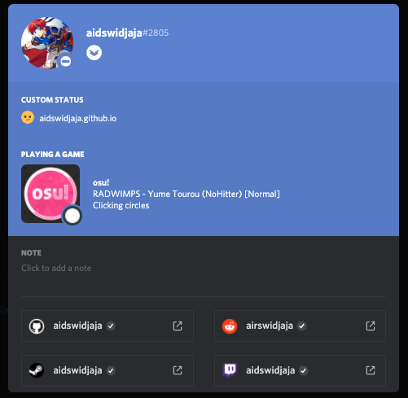

################################################
Discord Rich Presence (non-WS11 WineskinServer)
################################################

.. rst-class:: wineskin-version
    
    | This article is applicable to the following wrappers:
    | • `slc <https://osu.ppy.sh/users/7978076>`_'s `Wineskin for macOS 10.14 Mojave and earlier <https://osu.ppy.sh/community/forums/topics/682197?start=6919344>`_

.. note::

    This section is for users using Wineskins that don't have either the **WS11WineCX19.0.1-1** or **WS11WineCX64Bit19.0.1-1** Wine engine from`Gcenx <https://github.com/Gcenx/WineskinServer>`_. **To find your Wineskin version:**

    1. Locate where ``osu!.app`` is installed
    2. Right click on it and select **Show Package Contents**
    3. You should now see three files/folders: ``Contents``, ``drive_c`` and ``Wineskin``. Click ``Wineskin``
    4. A window should pop up. Click **Advanced**
    5. It will be displayed under the **Associated Extensions** column, as shown below.

    .. image:: ../assets/wineskin-engine-version.png
        :alt: Wineskin Advanced, highlighting the engine version number:
    
    If you're using one of the two **WS11** engines mentioned above, then the process behind Discord Rich Presence is slightly different - `you actually can enable Discord Rich Presence with relative ease <discord-10-15.html>`_.

****

****************************************
Behaviour
****************************************

osu! is not detected by Discord in the Game Activity menu, nor is it displayed on your profile.

****

****************************************
Cause
****************************************

`It's complicated. <discord-disc.html>`_ 

**tl:dr** currently available Discord Rich Presence solutions rely on using a 64-bit Wineskin engine, whereas some of the older wrappers use a 32-bit engine.

****

****************************************
Resolution
****************************************

Currently, Discord Rich Presence is not possible on older Wineskins that don't utilise the 64-bit WS11 WineskinServer. This includes `slc <https://osu.ppy.sh/users/7978076>`_'s `Wineskin for macOS 10.14 Mojave and earlier <https://osu.ppy.sh/community/forums/topics/682197?start=6919344>`_. Noone has made a successful Discord Rich Presence solution running under a 32-bit Wineskin. If you want Discord Rich Presence to work, you need to use a 64-bit Wineskin such as `Technocoder <https://osu.ppy.sh/users/10338558>`_'s `Wineskin with macOS Catalina 10.15 support <https://osu.ppy.sh/community/forums/topics/1106057>`_ in order to get it up and running.

You can read my `Discord Rich Presence discussion article <discord-disc.html>`_ to learn about why I had some trouble with getting Rich Presence to work on my Wineskin.

.. note::

    Do you have anything to add? See our `Contributing <../about/contributing.html>`_ to see how you can contribute to these docs.