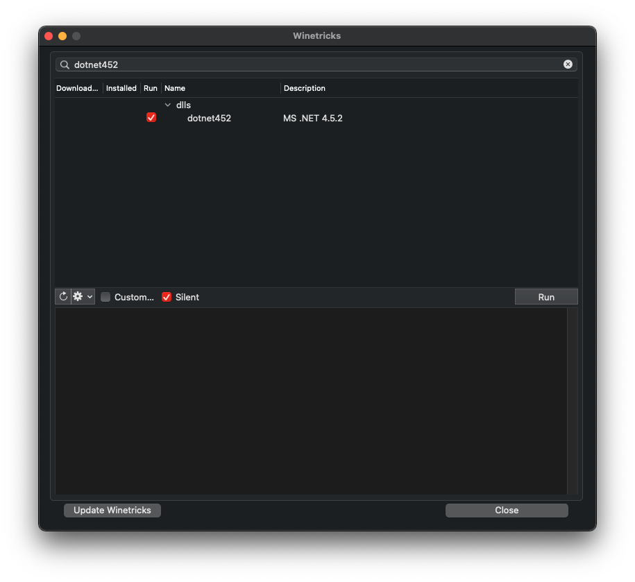

#############################################################
.NET runtime issues
#############################################################

.. rst-class:: wineskin-version
    
    | This article is applicable to the following wrappers:
    | • `Technocoder <https://osu.ppy.sh/users/10338558>`_'s `Experimental Wineskin with macOS Catalina 10.15 support <https://osu.ppy.sh/community/forums/posts/7367239>`_
    | • `Technocoder <https://osu.ppy.sh/users/10338558>`_'s `Wineskin with Apple Silicon support <https://osu.ppy.sh/community/forums/topics/1106057>`_

.. note::

    We are currently aware of this known issue that is affecting a considerable number of users, and currently there is no absolute fix. Track our progress and help us solve this issue by reporting about your experience on our `osu! forum thread <https://osu.ppy.sh/community/forums/topics/1106057>`_. Let us know what worked (and what didn't!)

****

****************************************
Behaviour
****************************************

You experience issues with the .NET framework which osu! relies on.

This is best diagnosed through a Wineskin `Test Run <troubleshooting.html#generating-logs-for-wineskin>`_. If you're experiencing .NET issues, you may receive the following console output:

.. code-block:: csharp

    0033:fixme:advapi:RegisterEventSourceW ((null),L".NET Runtime"): stub
    0033:fixme:advapi:ReportEventW (0xcafe4242,0x0001,0x0000,0x000003ff,0x0,0x0001,0x00000000,0x31d64c,0x0): stub
    0033:err:eventlog:ReportEventW L"Application: osu!.exe\nFramework Version: v4.0.30319\nDescription: The process was terminated due to an internal error in the .NET Runtime at IP 00E03BED (00D90000) with exit code 80131506.\n"

****

****************************************
Cause
****************************************

Currently, we are experiencing a considerable number of issues in relation to getting osu! to work, including issues with the .NET framework. The exit code in a standard run indicates a low-level garbage collection issue, while running ``osu!.exe`` through Wine Command Prompt will return a binary translation error. However, we are still not entirely sure what is causing this issue and/or how to rectify it. You can try some of the Resolution steps below; success may vary.

****

****************************************
Resolution
****************************************

Firstly, make sure you're using the latest Wineskin available, which you can get from `this thread <https://osu.ppy.sh/community/forums/topics/1106057>`_. If you're on a Apple Silicon device, try running both the Rosetta and Intel Wineskins. They've been updated with beta WineskinServer versions from `Gcenx <https://github.com/Gcenx/>`_, as part of our attempts to overcome this issue. 

.. note::

    Sometimes, you may need to click the osu! icon more than once in order to begin the process.

If your Wineskin is still not working, ensure you are actually experiencing this issue by following our `Troubleshooting <troubleshooting.html>`_ steps.

Still experiencing issues? In that case, we'll need to dig deeper. Try each of the options below in order, and see if that fixes your issue. If it does, **let us know** on the `forum thread <https://osu.ppy.sh/community/forums/topics/1106057>`_ so we can help you and other people better.

=======================================
Running through Command Prompt
=======================================

1. Locate your osu! installation.
2. Right click on it, then select **Show Package Contents**.
3. Open **Wineskin**.
4. Click **Advanced**, then navigate to the **Tools** tab.
5. Click **Command Line (cmd)** located under the Wine Tools heading.
6. It'll take some time for a console window to appear. When it does, run the following command:

.. code-block:: bash

    start ../../osu!/osu!.exe

On a working installation, osu! should start (albeit with performance issues). If this command fails, please screenshot the output and let us know on the `forum thread <https://osu.ppy.sh/community/forums/topics/1106057>`_.

=======================================
Updating dotnet
=======================================

Updating the ``dotnet`` Winetricks may help solve issues with the .NET framework.

.. danger::

    Before proceeding, **back it up!** Backing osu! files up is as easy as copying the entire osu! folder onto an external hard drive - and this is something all osu! players should do anyway!

.. danger::

    Noone is responsible if you lose all your data - back up your data and take extreme care, particular if you have important beatmaps and scores stored.

.. warning::

    On the bleeding edge? Once you update to ``dotnet452``, you will not be able to immediately revert to an older version. You may need to completely uninstall ``dotnet452`` and then install an older version of dotnet, for which instructions are not provided here.

1. Locate your osu! installation.
2. Right click on it, then select **Show Package Contents**.
3. Open **Wineskin**.
4. Click **Advanced**, then navigate to the **Tools** tab.
5. Click **Winetricks** located under the Utilities heading.
6. Search for ``dotnet452`` in the search bar.
7. Open the ``dlls`` dropdown in the list which appears.
8. Click the checkmark besides ``dotnet452``.
9. Click **Run**, then in the dialog which appears click **Yes**.
10. Wait for the process to finish before closing the Wineskin configuration utility.

.. note::

    The osu! Wineskin uses ``dotnet45`` by default.

****

****************************************
If that didn't work
****************************************

We continue to experience significant issues surrounding getting osu! to work for some users, particularly on macOS Big Sur and Apple Silicon devices. Check out our other Troubleshooting pages, including `this one <start.html>`_ to see if there are alternative fixes to your issue. If you're still having trouble, please visit the `Troubleshooting <troubleshooting.html>`_ page and let us know about your issue on this `forum thread <https://osu.ppy.sh/community/forums/topics/1106057>`_ - it greatly assists in helping us understand the issue further.

****

****************************************
Related links
****************************************

- https://osu.ppy.sh/community/forums/posts/7905487
- https://osu.ppy.sh/community/forums/topics/1243072
- https://osu.ppy.sh/community/forums/posts/7883281
- https://osu.ppy.sh/community/forums/posts/7886781
- `WineHQ: URL_ParseURL errors <https://forum.winehq.org/viewtopic.php?t=1093>`_
- `WineHQ: Reinstalling .NET <https://forum.winehq.org/viewtopic.php?t=33524&p=126602>`_
- `Stack Overflow: exit code 80131506 <https://stackoverflow.com/questions/4367664/application-crashes-with-internal-error-in-the-net-runtime>`_
- `Gcenx/WineskinServer on GitHub: dotnet4.5 install always fails <https://github.com/Gcenx/WineskinServer/issues/103>`_