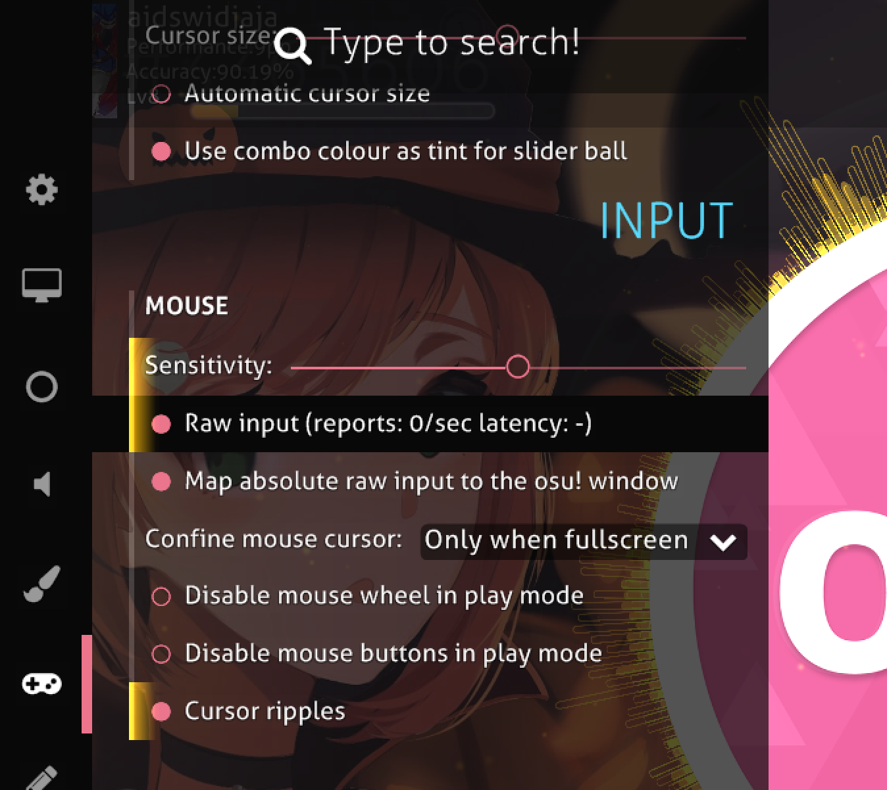

#############################################
osu! mouse/trackpad input feels unstable
#############################################

.. rst-class:: wineskin-version
    
    | This article is applicable to the following wrappers:
    | • `slc <https://osu.ppy.sh/users/7978076>`_'s `Wineskin for macOS 10.14 Mojave and earlier <https://osu.ppy.sh/community/forums/topics/682197?start=6919344>`_
    | • `Technocoder <https://osu.ppy.sh/users/10338558>`_'s `Wineskin with macOS Catalina 10.15 support <https://osu.ppy.sh/community/forums/topics/1106057>`_
    | • `Technocoder <https://osu.ppy.sh/users/10338558>`_'s `unofficial Wineskin for macOS 10.14 Mojave and earlier <https://osu.ppy.sh/community/forums/topics/682197>`_

****

****************************************
Behaviour
****************************************

osu! mouse or trackpad movement feels unstable, the cursor may jump, be extremely inprecise, or otherwise be unusable.

****

****************************************
Cause
****************************************

The cause of this issue is unknown, but it could be something to do with how Wine translates macOS cursor movements to Windows API calls (since osu! doesn't use the standard macOS cursor like other Wine programs).

Generally speaking, you might like to avoid increasing mouse sensitivity inside osu!, especially if you're playing in a window. Instead, change your mouse sensitivity through macOS System Preferences > Mouse (or Trackpad).

****

****************************************
Resolution
****************************************

1. Open the in-game settings menu inside osu! using the ``Ctrl-O`` shortcut
2. Find the **Mouse** section.
3. Enable **Raw input** and **Map absolute raw input to osu! window**

****

****************************************
If that didn't work
****************************************

There could be something else going on here, and performing `basic troubleshooting <troubleshooting.html>`_ should help you get to the bottom of it.

If you're not sure what's going on here, copy any osu! crash logs as well as `generating a report with osu!macOS Agent <troubleshooting.html#generating-a-report-with-osu-macos-agent>`_, and let us know on the forums.
