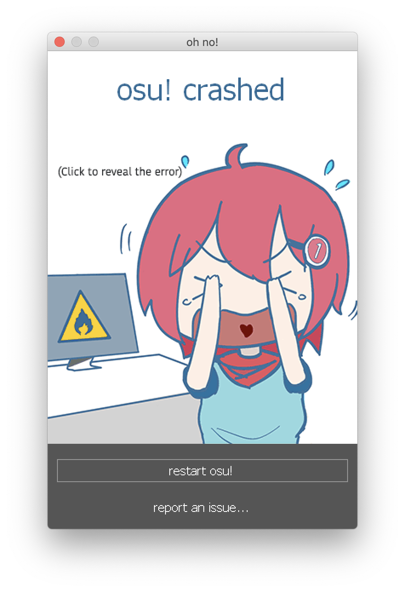

#############################################
Troubleshooting Basics
#############################################

.. rst-class:: wineskin-version
    
    | This article is applicable to the following wrappers:
    | • `slc <https://osu.ppy.sh/users/7978076>`_'s `Wineskin for macOS 10.14 Mojave and earlier <https://osu.ppy.sh/community/forums/topics/682197?start=6919344>`_
    | • `Technocoder <https://osu.ppy.sh/users/10338558>`_'s `Wineskin with macOS Catalina 10.15 support <https://osu.ppy.sh/community/forums/topics/1106057>`_
    | • `Technocoder <https://osu.ppy.sh/users/10338558>`_'s `unofficial Wineskin for macOS 10.14 Mojave and earlier <https://osu.ppy.sh/community/forums/topics/682197>`_

This article is designed to give you the basics in troubleshooting osu!mac issues. It contains information on how to generate a report, troubleshooting techniques specific to Wine, and tips for communicating with other people in the osu!mac community.

********************************************
First steps
********************************************

To help us understand your issue a bit better, please perform the following initial troubleshooting & diagnostic steps as listed below. You can use this information to diagnose an issue yourself, or to `request support on the forums <https://osu.ppy.sh/community/forums/topics/1106057>`_.

============================================
Step 1: See Common Issues
============================================

Many issues already have solutions available to them. Check out the `installation guide <https://osu.ppy.sh/community/forums/posts/7560723>`_, `Common Issue section on osu!mac <https://osu-mac.readthedocs.io/en/latest/issues/index.html>`_ and the outdated `troubleshooting guide <https://osu.ppy.sh/community/forums/topics/679205>`_.

Here are some common ones we've been experiencing recently.

- `Wineskin.app doesn’t open, even if osu! does / exec[number].bat problem <wineskin.html>`_
- `osu! has graphical glitches, or isn't rendering icons/CJK fonts properly <gdiplus-cjkfonts.html>`_
- `Apple Silicon / Big Sur issues <applesilicon-bigsur.html>`_
- `Discord Rich Presence (32-bit Wineskins) <discord-10-14.html>`_

===============================================
Step 2: Report and repair using osu!macOS Agent
===============================================

1. Download the latest version of Technocoder's `osu!macOS Agent <https://osu.ppy.sh/community/forums/topics/1036678>`_ - older versions may have incompatibilities or bugs, especially with newer wrappers.
2. Once it finishes downloading, open **osu!macOS Agent**.
3. If you haven't already done so, click the **Select** button and browse to ``osu!.app's`` location. The text box should display its filepath (e.g ``~/Users/firefly/Desktop/osu!.app``) and Wine Engine (e.g ``WS11WineCX64Bit19.0.1-1``)
4. Select the **Troubleshoot** tab, then click **Scan**.
5. After the scan completes, click **Repair**.
6. If this doesn't fix your issue, click **Copy Report**. Copy the contents into a reply to this thread and we'll do our best to help you out! Please don't forget to do a **Test Run** as outlined in the next step.

.. tip::

    osu!macOS Agent is a useful program every osu-stable player under Wine should have!

==============================================
Step 3: Generating a Test Run through Wineskin
==============================================

1. Locate your osu! installation.
2. Right click on it, then select **Show Package Contents**.
3. Open **Wineskin**.
4. Click **Advanced**.
5. Click **Test Run**. If osu! starts successfully (even with glitches), you can then close the program down.

.. image:: ../assets/wineskin-test-run.png

6. Once osu! has either closed or crashed, a dialog will pop up asking you whether you want to view **Test Run Logs**. Click **Yes**.

.. image:: ../assets/wineskin-test-run-success.png

7. Two plain-text files will appear. One contains information about your system and Wineskin, while the other provides a log of errors, warnings and events that were recorded while your Wineskin was operating. Copy the results of your **Test Run logs** to a pastebin such as `paste.ubuntu.com <https://paste.ubuntu.com>`_ set to never expire. It is now ready to share with others! Feel free to contact us on the `osu! on Mac forum thread <https://osu.ppy.sh/community/forums/topics/1106057>`_ if you need any help.

****

********************************************
Additional troubleshooting
********************************************

Here are some additional troubleshooting tips that might help you diagnose and fix any issues you're experiencing.

============================================
Accessing the insides of your Wineskin
============================================

Generally speaking, you can access the Package Contents of your Wineskin by right clicking on ``osu!.app`` and selecting **Show Package Contents**. 

Three items should now appear:

- **Contents** is a directory that Wineskin uses to store all its files - generally you won't need to access this folder for troubleshooting
- **drive_c_** is an alias (shortcut) that represents a Windows filesystem which Wine imitates
- **Wineskin** is the program you use to manage, edit, and troubleshoot your Wineskin

****

============================================
Locating osu! crash logs
============================================

Just like on Windows, osu! will generate it's own crash logs that can be useful for troubleshooting.

If a dialog like the one below appears:

Click on the window. You should be able to view the crash logs now:

.. image:: ../assets/osu-crash-log.png
    :alt: osu! crash log.

You can also find more logs under the Logs folder in your ``drive_c`` directory. To do this:

1. Locate where ``osu!.app`` is installed
2. Right click on it and select **Show Package Contents**
3. You should now see three files/folders: ``Contents``, ``drive_c`` and ``Wineskin``. Click ``drive_c``
4. Then, click ``osu!``
5. Select ``Logs``

Your log files should be present here.

****

********************************************
Generating a report with osu!macOS Agent
********************************************

To generate a report with `Technocoder <https://osu.ppy.sh/users/10338558>`_'s osu!macOS Agent:

1. Open osu!macOS Agent (duh)
2. Click the **Troubleshoot** report
3. Click **Scan**
4. Upon completion of the scan, click **Copy Report**

    - Save this to a text file or someplace where you won't forget

.. tip::

    osu!macOS Agent is a useful program every osu-stable player under Wine should have!

****

********************************************
Generating logs for Wineskin
********************************************

If your Wineskin isn't starting or working properly, you can try diagnosing the issue with a Test Run of your Wineskin, that will produce logs that will describe any problems in detail.

To generate a Wineskin log:

1. Open the Wineskin program by following `these instructions <#accessing-the-insides-of-your-wineskin>`_
2. Click the **Advanced** tab
3. Click the **Test Run** button

.. image:: ../assets/wineskin-test-run.png

4. If osu! starts, you can close the program immediately (unless you need to test an issue that occurs at a particular moment in time, like when editing beatmaps)
5. A window like the one below will appear. Click **Yes**

.. image:: ../assets/wineskin-test-run-success.png

Two plain-text files will appear. One contains information about your system and Wineskin, while the other provides a log of errors, warnings and events that were recorded while your Wineskin was operating. 

Save both of these to a text file or someplace where you won't forget. If you're generating logs for another person, you can use a pastebin such as `paste.ubuntu.com <https://paste.ubuntu.com>`_ to share your log files with them.

****

============================================
Communicating your issues with other people
============================================

We want to help you get osu! running on your macOS-powered device, so to make the process as easy as possible for everyone involved, it's important to be clear and concise right from the get-go.

**Please do:**

- Work through the `First steps <#first-steps>`_ section before posting for help
- See the `Common issues <index.html>`_ section to see if there's a fix you can try
- Describe your issue in lots and lots of detail

    - You can make a distinction between expected behaviour (what you think is supposed to happen) and actual behaviour (what actually ends up happening) in your issue report

- Provide information on when/why your issue happens (if you know)
- Provide information about your computer specs and the wrapper you used
- Attach screenshots and log files (from both `osu!macOS Agent <#generating-a-report-with-osu-macos-agent>`_ and `Wineskin <#generating-logs-for-wineskin>`_
- Tell us what you've already tried to do

The best place to report issues is on the `osu! forums <https://osu.ppy.sh/community/forums/5>`_ and the `osu! for macOS support thread `<https://osu.ppy.sh/community/forums/topics/1106057>`_ - make sure you put **macOS** in the title of your post (so other people know ofc). 

