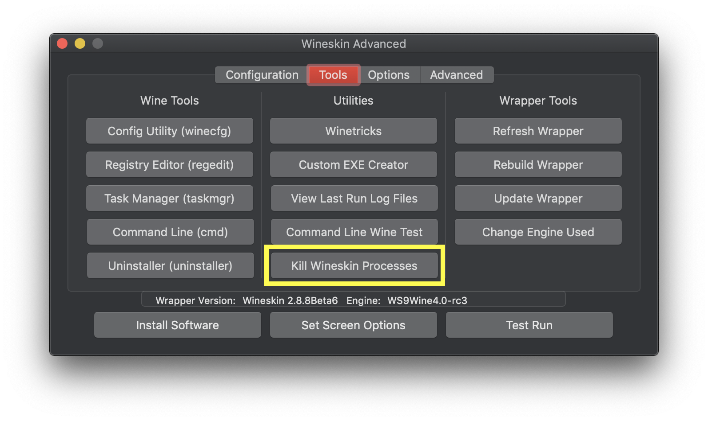
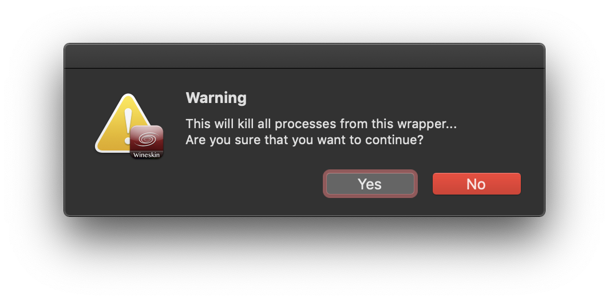
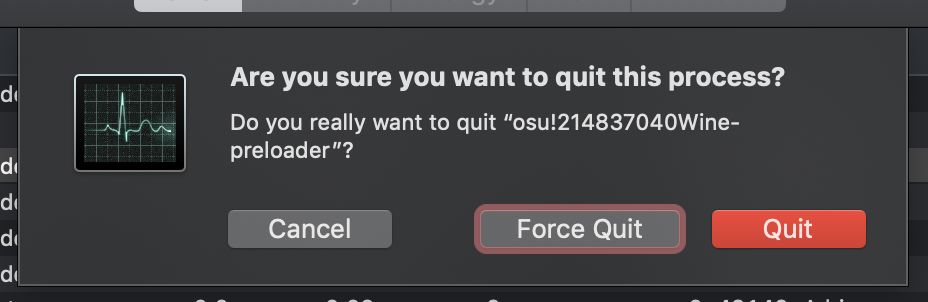

########################################
osu! won't close
########################################

.. rst-class:: wineskin-version
    
    | This article is applicable to the following wrappers:
    | • `slc <https://osu.ppy.sh/users/7978076>`_'s `Wineskin for macOS 10.14 Mojave and earlier <https://osu.ppy.sh/community/forums/topics/682197?start=6919344>`_
    | • `Technocoder <https://osu.ppy.sh/users/10338558>`_'s `Wineskin with macOS Catalina 10.15 support <https://osu.ppy.sh/community/forums/topics/1106057>`_
    | • `Technocoder <https://osu.ppy.sh/users/10338558>`_'s `unofficial Wineskin for macOS 10.14 Mojave and earlier <https://osu.ppy.sh/community/forums/topics/682197>`_

****

****************************************
Behaviour
****************************************

osu! is stuck in an update loop, it's hung and won't close, or you suspect some leftover processes are still running on your system.

****

****************************************
Cause
****************************************

On first run, osu! will try to update, but due to incompatibilities between the update server and Wine, it will continually restart the application. 

Alternatively, osu! or Wine has either crashed, hung, or closed without killing all processes.

****

****************************************
Resolution
****************************************

You can kill all Wineskin processes associated with your osu! wrapper in **Wineskin** options.

1. Locate where ``osu!.app`` is installed
2. Right click on it and select **Show Package Contents**
3. You should now see three files/folders: ``Contents``, ``drive_c`` and ``Wineskin``. Click ``Wineskin``
4. A window like the one below should pop up. Click **Advanced**

.. image:: ../assets/wineskin.png

5. Click the **Tools** tab
6. Under the **Utilities** heading, select **Kill Wineskin Processes**

7. Accept the dialog box by clicking **Yes**

8. Wait for the tool to run. Once it is finished, close Wineskin by clicking the close icon (in the top-left corner) and then clicking **Quit**

.. raw:: html

    

    
<h4 style="display: inline;">If you are unable to access Wineskin options</h4>

     

You need to go to your ``Applications/Utilities`` folder and open Activity Monitor. From there, kill all of the Wine processes. 

1. Type ``wine`` into the search bar. You'll see a number of different ``wine``, ``wine-preloader`` and ``osu-wine`` processes around.

.. image:: ../assets/activity-monitor-1.png

2. Click on the ``Wineserver`` process (or a random one if that doesn't exist), then click the |Activity Monitor close| icon.

.. |Activity Monitor close| image:: ../assets/activity-monitor-close.png
    :height: 30px

3. You'll reach a dialog that looks like this. Click ``Quit`` to close the application, or click ``Force Quit`` if the process is not responding or normal ``Quit`` doesn't work.

.. warning::

    Make sure you don't have any other Wine processes running in the background (and if you do, differentiate them from osu! before you kill the processes).

4. You'll need to repeat **steps 2 and 3** for each process (though they may disappear automatically after killing one)

.. raw:: html

    

     

****************************************
If that didn't work
****************************************

If that didn't work, you should probably restart your computer. Perform basic `troubleshooting <troubleshooting.html>`_ and ask for help on the `osu! forums <https://osu.ppy.sh/community/forums/5>`_.