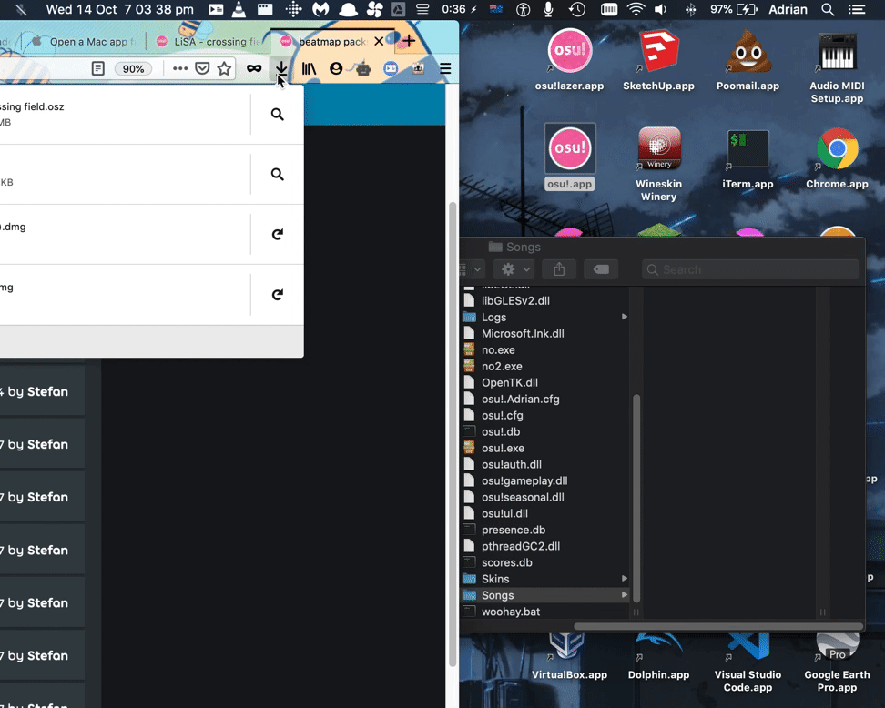

#############################
Importing beatmaps and skins
#############################

.. rst-class:: wineskin-version
    
    | This article is applicable to the following wrappers:
    | • `slc <https://osu.ppy.sh/users/7978076>`_'s `Wineskin for macOS 10.14 Mojave and earlier <https://osu.ppy.sh/community/forums/topics/682197?start=6919344>`_
    | • `Technocoder <https://osu.ppy.sh/users/10338558>`_'s `Wineskin with macOS Catalina 10.15 support <https://osu.ppy.sh/community/forums/topics/1106057>`_
    | • `Technocoder <https://osu.ppy.sh/users/10338558>`_'s `unofficial Wineskin for macOS 10.14 Mojave and earlier <https://osu.ppy.sh/community/forums/topics/682197>`_

****

.. note::

    If you're new to osu! and don't know how all this beatmap and skin stuff work:

    - `Adding beatmapsets on osu! knowledge base <https://osu.ppy.sh/help/wiki/Installation#adding-beatmapsets>`_
    - `Skinning FAQ on osu! knowledge base <https://osu.ppy.sh/help/wiki/Skinning/FAQ>`_

.. note::

    osu!macOS Agent can automatically move beatmaps and skins from your Downloads folder. Just make sure to enable the checkboxes inside osu!macOS Agent settings. More information available below.

***************************************
Importing beatmaps and skins
***************************************

Importing beatmaps into osu! is quite easy, and there's a number of ways you can get this to work with your osu! Wineskin.

=======================================
Using osu!macOS Agent
=======================================

You can have beatmaps automatically moved from your Downloads folder to osu!, with the help of `Technocoder <https://osu.ppy.sh/users/10338558>`_'s  `osu!macOS Agent <https://osu.ppy.sh/community/forums/topics/1036678>`_ program. To enable this:

1. Open osu!macOS Agent
2. In the **General** tab, locate the **Location:** field. Make sure this points to your osu! install (e.g ``/Users/Adrian/Desktop/osu!.app``)
3. Enable the following checkboxes

    - Automatically move beatmaps from Downloads
    - Automatically move skins from Downloads

You can also enable

    - Automatically open replays from Downloads

4. Leave osu!macOS Agent running. The next time you download a beatmap from the osu! website, it should automatically move to your osu! wrapper. Then just hit F5 (beatmaps) or Ctrl-Alt-Shift-S (skins) to refresh.

=======================================
Drag and drop
=======================================

You might also be able to drag and drop beatmaps and skins into osu! directly. In my personal experience this only works with `Technocoder <https://osu.ppy.sh/users/10338558>`_'s `Wineskin with macOS Catalina 10.15 support <https://osu.ppy.sh/community/forums/topics/1106057>`_.

If osu! is full screen, you can use Mission Control (F4 key) to switch between windows.

=======================================
Click to import
=======================================

.. note::

    Users have reported issues with this on `Technocoder <https://osu.ppy.sh/users/10338558>`_'s `Wineskin with macOS Catalina 10.15 support <https://osu.ppy.sh/community/forums/topics/1106057>`_, see `community/forums/posts/7805376 <https://osu.ppy.sh/community/forums/posts/7805376>`_.

You can set up osu! to automatically open and import a beatmap or skin when you click on it in your Downloads folder or web browser.

1. Download a random osu beatmap or skin (and get the osz file)
2. Right click on **osu!.app**
3. Click **Show Package Contents**
4. Navigate to ``drive_c/osu!/Songs`` and drag & drop your ``osz`` or ``osk`` beatmap into there
4. Go back a few folders until you reach **Wineskin.app**, and click to pen it!
5. Click **Advanced**. You should see a screen like the one below

.. image:: assets/wineskin-extension.png
    :alt: Wineskin options showing Associated Extensions.

Note the Associated Extensions section. If the ``osz2``, ``osr``, ``osz`` and ``osu`` extensions aren't there, add them using the + button.

To verify that this has all been set up correctly:

6. Click **Tools**, then click **Command Line** (cmd). A console-like should open (it takes a while tho)
7. Type ``explorer.exe``
8. Navigate to ``My Computer\osu!\Songs`` in the window that appears and locate the osz beatmap you just dropped
9. Right click on the file, click **Properties** and verify it worked. It should look like the image below.

.. image:: assets/properties-extension.png
    :alt: Wine Explorer showing Properties for osz extensions.

.. note::

    This method tends to be more unreliable than the others listed and you may experience varying degrees of success.

=======================================
Manual import
=======================================

To manually import a beatmap into osu!, follow the following instructions:

1. Find your ``Songs`` directory

    - Locate where ``osu!.app`` (your Wineskin) is installed
    - Right click on it and select ``Show Package Contents``
    - You should now see three files/folders: ``Contents``, ``drive_c`` and ``Wineskin``. Click ``drive_c``.
    - From here, click ``osu!``.
    - From here, locate ``Songs``

.. tip::

    You can create an alias or shortcut pointed to your Songs directory, in somewhere handy like your Desktop. Then you can quickly access the folder whenever you want to drop beatmaps in.

    To create an alias, click on the ``Songs`` folder, then go to **File** > **Make Alias** - then put this alias somewhere where you can easly access it.

2. Find a beatmap on `osu.ppy.sh <https://osu.ppy.sh/beatmapsets>`_. For this example, we'll use `Ryofuka's crossing field <https://osu.ppy.sh/beatmapsets/68500>`_.
3. Just like you would normally, click the **Download** button to download the beatmap.
4. You should now have a ``.osz`` file in your Downloads file. Drag and drop this file into the ``Songs`` directory we located before.

.. tip::

    To avoid potential import issues, remove any non-alphabetical characters (numbers and hyphens are fine)

.. note::

    Yes, my beatmap folder is very empty (but yours won't be! Unless it is, of course..)

5. If you don't have osu! open already, open it now. Then in-game, press ``F5``

.. note::

    Unless you have function keys enabled, you may need to press the ``Fn`` button at the same time.

    .. raw:: html

         
        

        
<h4 style="display: inline;">Use F1, F2, etc. as standard function keys</h4>

         

    1. Locate where ``osu!.app`` is installed
    2. Right click on it and select **Show Package Contents**
    3. You should now see three files/folders: ``Contents``, ``drive_c`` and ``Wineskin``. Click ``Wineskin``
    4. A window like the one below should pop up. Click **Advanced**

    .. image:: ../assets/wineskin.png
        :alt: Wineskin settings.

    5. Click the **Options** tab
    6. Select **Use F1, F2, etc. as standard function keys**

    .. raw:: html

        

         

.. tip::

    You can do all of this while leaving osu! running open in the background!

****

***************************************
A note about importing skins
***************************************

Importing skins is largely the same process, except instead of the ``Songs`` directory, use the ``Skins`` directory, and to reload osu! use ``Ctrl-Alt-Shift-S`` instead of ``F5``.

You can then select your skin as normal from the osu! in-game settings menu.

.. note::

    Treat this as if you were working on a Windows system. If the skin is compressed, you'll probably need to uncompress it. You can use something like `The Unarchiver <https://theunarchiver.com/>`_ or even your in-built Archive Utility to do this (though Archive Utility might not have so much fun with ``.rar`` or ``.7zip`` files)

    See the `osu! knowledge base <https://osu.ppy.sh/help/wiki/Installation#adding-skins>`_ for more info.

****

***************************************
Related links
***************************************

- https://osu.ppy.sh/community/forums/posts/7756512