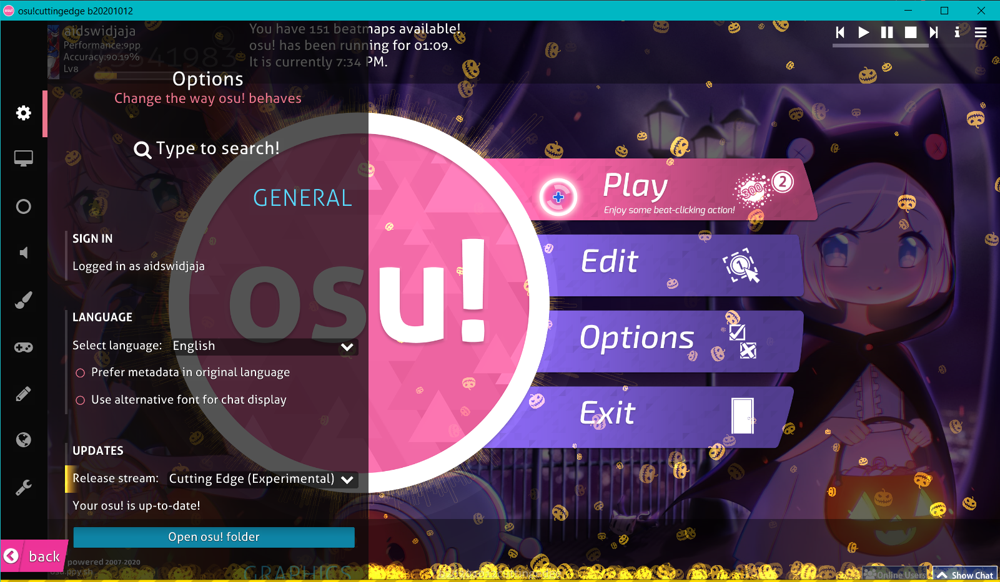
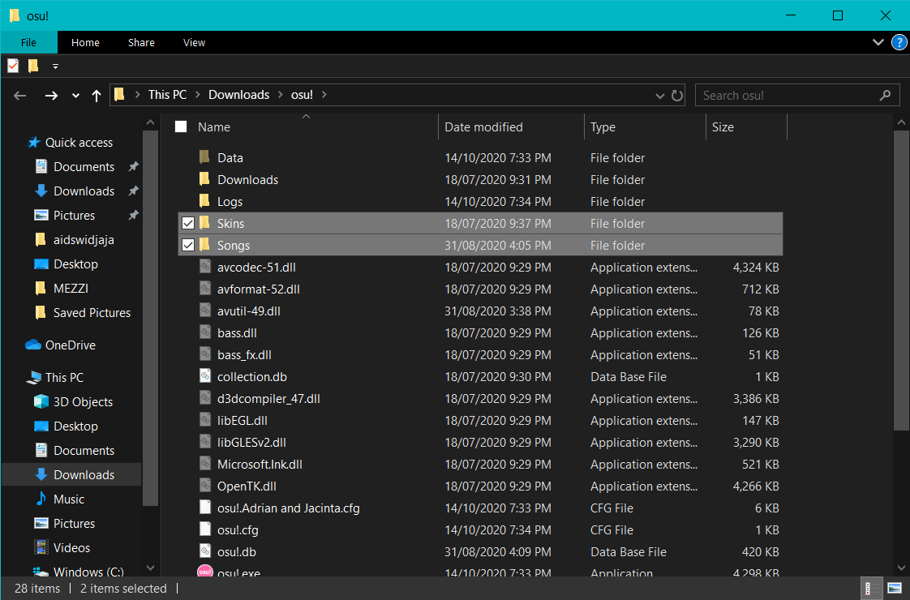
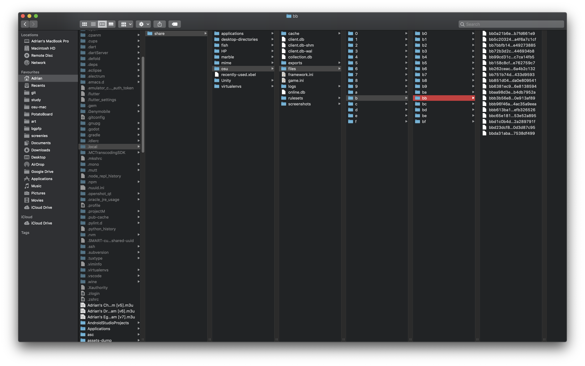
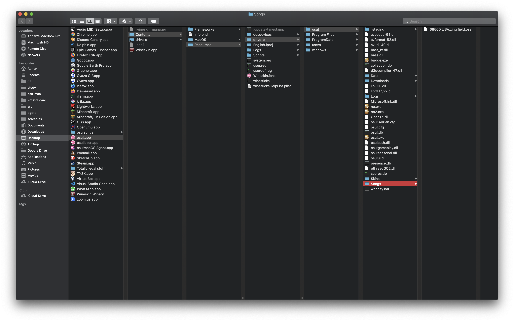

##########################################################
Transferring data from another osu! installation
##########################################################

.. rst-class:: wineskin-version
    
    | This article is applicable to the following wrappers:
    | • `slc <https://osu.ppy.sh/users/7978076>`_'s `Wineskin for macOS 10.14 Mojave and earlier <https://osu.ppy.sh/community/forums/topics/682197?start=6919344>`_
    | • `Technocoder <https://osu.ppy.sh/users/10338558>`_'s `Wineskin with macOS Catalina 10.15 support <https://osu.ppy.sh/community/forums/topics/1106057>`_
    | • `Technocoder <https://osu.ppy.sh/users/10338558>`_'s `unofficial Wineskin for macOS 10.14 Mojave and earlier <https://osu.ppy.sh/community/forums/topics/682197>`_

****

.. note::

    You can also use these same instructions to transfer your osu! configuration file (we've left it out to keep the instructions clean). Your osu! configuration file is entitled ``osu.yourcomputername.cfg``. For example, my configuration file is called osu!.Adrian.cfg`` and it looks like this:

    .. image:: ../assets/osu-config.png
        :alt: osu! user configuration file.

    It is located in the same directory as your ``Songs`` or ``Skins`` directories.

    .. danger::

        You should remove all screen-resolution related properties as this may crash your game (see `Common issues: osu! was unable to obtain a graphics context. <../issues/graphics.html>`_) - be careful out there!

****************************************************
Transferring from a different osu! Wineskin
****************************************************

*Well this is about to get meta*

.. danger::

	These steps will **not** transfer over replays and scores.

To transfer Songs or Skins from another osu! Wineskin:

1. In your **old osu! Wineskin**, find your ``Songs`` or ``Skins`` directory

    - Locate where your **old** ``osu!.app`` (your Wineskin) is installed
    - Right click on it and select ``Show Package Contents``
    - You should now see three files/folders: ``Contents``, ``drive_c`` and ``Wineskin``. Click ``drive_c``.
    - From here, click ``osu!``.
    - From here, locate ``Songs`` or ``Skins``

2. Then, in your **new** osu! Wineskin, find your ``Songs`` or ``Skins`` directory

    - Locate where your **new** ``osu!.app`` (your Wineskin) is installed
    - Right click on it and select ``Show Package Contents``
    - You should now see three files/folders: ``Contents``, ``drive_c`` and ``Wineskin``. Click ``drive_c``.
    - From here, click ``osu!``.
    - From here, locate ``Songs`` or ``Skins``

3. Replace the directories in your **new** osu! Wineskin with that from your **old** osu! Wineskin

****

****************************************************
Transferring from Windows
****************************************************

To transfer Songs or Skins from an osu! installation on Windows:

1. In Windows, open **osu!**
2. Inside the game, open in-game settings (you can use the ``Ctrl-O`` shortcut to perform this)

3. Click **Open osu! folder**
4. It should show you your osu! installation directory:

5. Here are your ``Songs`` and ``Skins`` directories. Put this on a USB drive or someplace which you can access from your Mac later on.
6. On your Mac, locate your osu! Wineskin and find your ``Songs`` or ``Skins`` directory

    - Locate where your **new** ``osu!.app`` (your Wineskin) is installed
    - Right click on it and select ``Show Package Contents``
    - You should now see three files/folders: ``Contents``, ``drive_c`` and ``Wineskin``. Click ``drive_c``.
    - From here, click ``osu!``.
    - From here, locate ``Songs`` or ``Skins``

7. Replace the directories in your **new** osu! Wineskin with that from your **Windows** install of osu!.

****

****************************************************
Transferring to osu!lazer
****************************************************

Transferring game data from osu! on Wine to a local osu!lazer installation is currently not possible at this time, but it is likely to come in the future.

The reason is because the in-built "Import from Stable" buttons in osu!lazer use registry keys to determine where your install of osu-stable is (and obviously macOS doesn't have registry keys).

You should `import your beatmaps and skins manually instead <import.html>`_.

Feel free to `contribute though to the development of osu!lazer and get a custom install path function set up <https://github.com/ppy/osu/issues/1907>`_.

.. note::

    Actually this isn't entirely true.

    `jorolf <https://osu.ppy.sh/users/7004641>`_'s `osu-lazer-beatmap-importer <https://github.com/jorolf/osu-lazer-beatmap-importer>`_ allows you to zip your osu-stable (under Wine) files and then open them with osu!lazer. But it's Windows only, and while I could probably make it work on macOS, like most of the things in my life I don't have a lot of time on my hands right now.

    If you're wlling to mess around a bit with some code, feel free to fork the repo (which is licensed under the MIT License) and work on making a port to macOS.

****

****************************************************
Transferring from osu!lazer
****************************************************

Transferring game data from osu!lazer to an osu! on Wine installation is currently not possible at this time.

This is because the filetypes used by osu-stable and osu!lazer are very different.

(above) osu!lazer file directory setup.
(below) osu-stable fle directory setup.
yes I know I only have one beatmap ``.osz`` in my stable install..

You should `import your beatmaps and skins manually instead <import.html>`_.

.. note::

    Well I guess it is actually sort of possible rn.

    For someone who plays more on lazer than stable, having a beatmap importer that could import files from lazer to stable sure would be useful!

    And actually, that already exists.

    `Ringosham <https://osu.ppy.sh/users/9507946>`_'s `Lazer exporter <https://github.com/ringosham/Lazer-exporter/>`_ has a number of features that make importing and exporting beatmaps on osu!lazer quite easy, including **being able to export Lazer beatmaps** to ``.osz``. Naisu.

    Unfortunately, it only works on Windows, and while I could probably make it work on macOS, and as previously mentioned, like most of the things in my life I don't have a lot of time on my hands right now :(

        If you're wlling to mess around a bit with some code, feel free to fork the repo (which is licensed under the Apache-2. License) and work on making a port to macOS.

